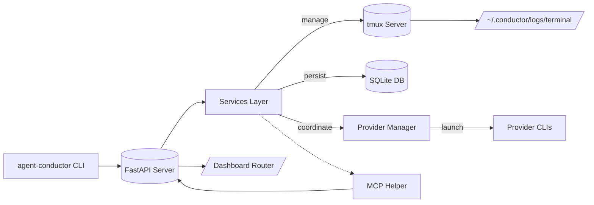
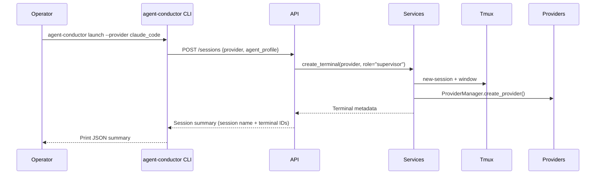
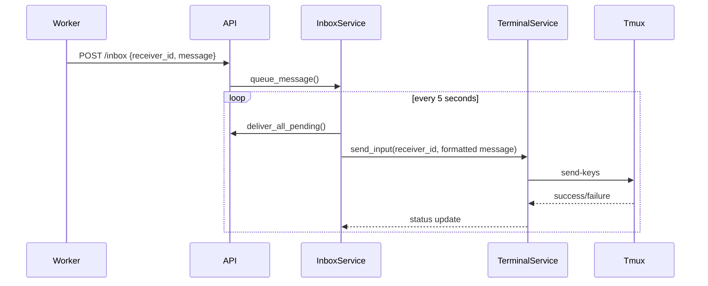
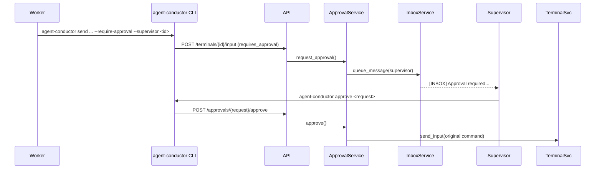

# Architecture Diagrams

The following Mermaid diagrams visualise the core control flows in Agent Conductor. Paste them into a Mermaid-compatible renderer (VS Code Markdown preview, GitHub, or [https://mermaid.live](https://mermaid.live)) to view.

## Component Map

## Session Launch Sequence

## Inbox Delivery Loop

## Approval Workflow

These diagrams complement `docs/architecture-overview.md` and should stay in sync with that narrative as the system evolves.
