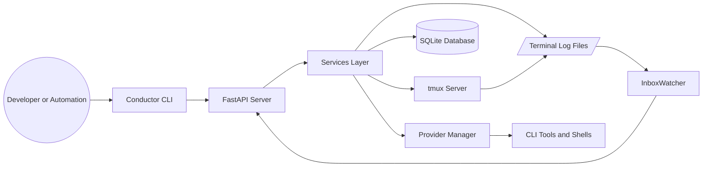
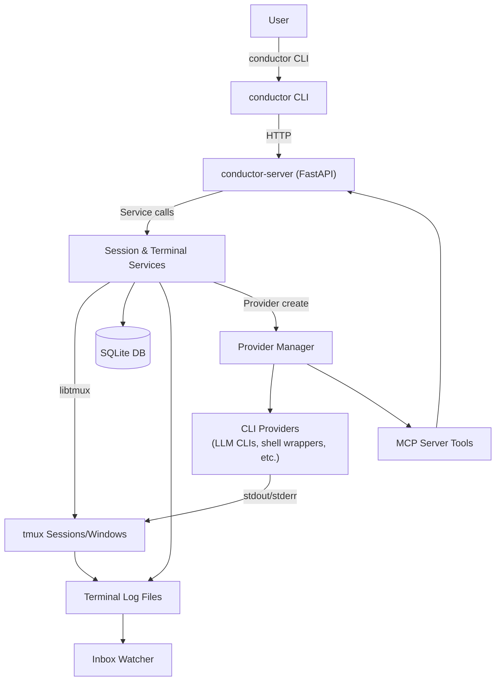
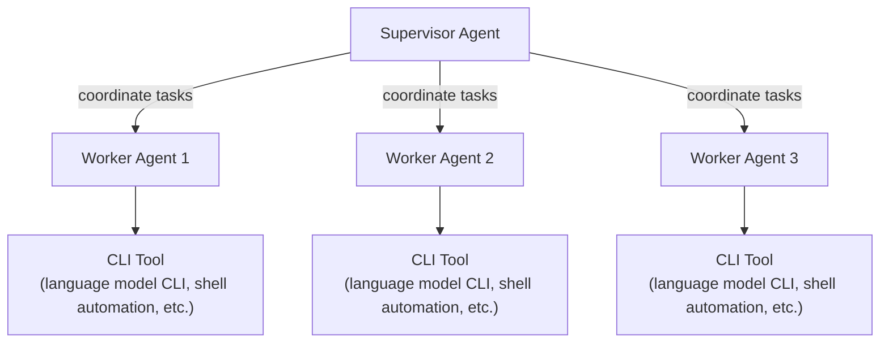
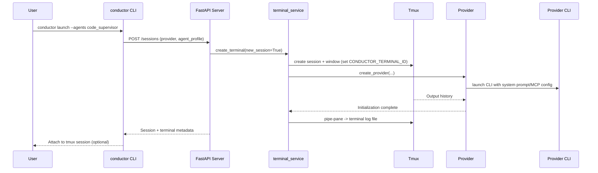
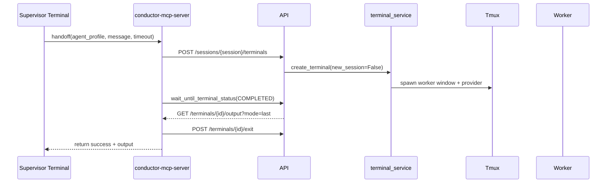
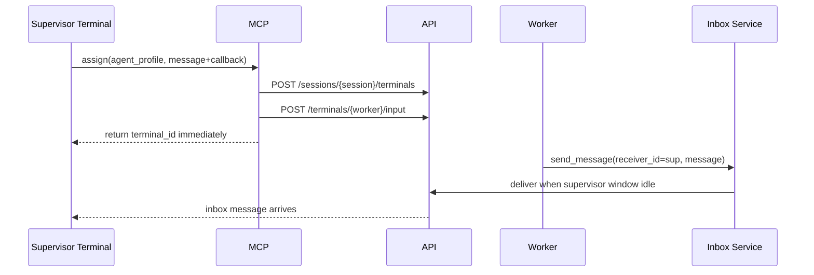
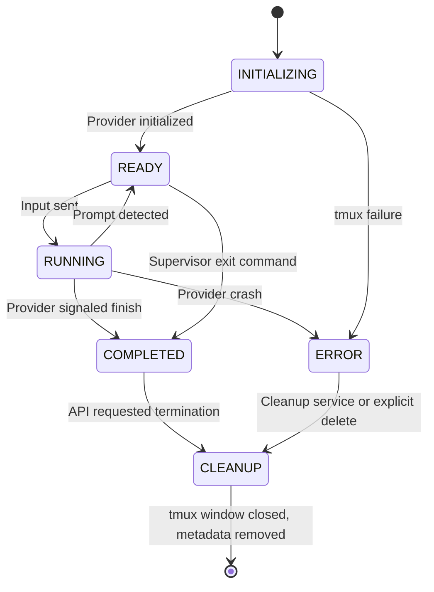

# CLI Agent Conductor Architecture Overview

This document provides a comprehensive blueprint for designing, deploying, and operating Agent Conductor—a tmux-based orchestrator for multi-agent command-line workflows. The intent is to equip another AI or human engineer with enough detail to rebuild the system from scratch without additional context. All module references align with the `src/agent_conductor` package.

## Table of Contents
- [Introduction](#introduction)
- [Design Goals](#design-goals)
- [Glossary](#glossary)
- [System Context](#system-context)
- [High-Level Components](#high-level-components)
- [Multi-Agent Coordination](#multi-agent-coordination)
- [Component Deep Dive](#component-deep-dive)
- [Conductor CLI](#conductor-cli)
- [FastAPI Server](#fastapi-server)
- [Services Layer](#services-layer)
- [tmux Client](#tmux-client)
- [Provider Manager](#provider-manager)
- [MCP Server](#mcp-server)
- [Persistence and Data Access](#persistence-and-data-access)
- [Request Lifecycles](#request-lifecycles)
- [Launch Sequence](#launch-sequence)
- [Handoff Flow](#handoff-flow)
- [Assign Flow](#assign-flow)
- [Terminal Lifecycle State Machine](#terminal-lifecycle-state-machine)
- [Data Model Reference](#data-model-reference)
- [Configuration and Environment](#configuration-and-environment)
- [CLI Command Reference](#cli-command-reference)
- [REST API Reference](#rest-api-reference)
- [Background Workers and Schedulers](#background-workers-and-schedulers)
- [Logging, Metrics, and Observability](#logging-metrics-and-observability)
- [Error Handling Strategy](#error-handling-strategy)
- [Security Considerations](#security-considerations)
- [Scalability and Performance](#scalability-and-performance)
- [Provider Development Guide](#provider-development-guide)
- [MCP Tool Integration](#mcp-tool-integration)
- [Inbox and Messaging Semantics](#inbox-and-messaging-semantics)
- [Flow Scheduling System](#flow-scheduling-system)
- [Deployment Topologies](#deployment-topologies)
- [Operational Playbook](#operational-playbook)
- [Testing and Quality Assurance](#testing-and-quality-assurance)
- [Troubleshooting Guide](#troubleshooting-guide)
- [Future Enhancements](#future-enhancements)
- [Appendix A: Provider Interface Contract](#appendix-a-provider-interface-contract)
- [Appendix B: Example Agent Profile](#appendix-b-example-agent-profile)
- [Appendix C: Sample tmux Session Layout](#appendix-c-sample-tmux-session-layout)
- [Appendix D: Development Environment Setup](#appendix-d-development-environment-setup)
- [Appendix E: Checklist for New Deployments](#appendix-e-checklist-for-new-deployments)
- [Appendix F: Reference Implementation Map](#appendix-f-reference-implementation-map)
- [Appendix G: Glossary of Logs](#appendix-g-glossary-of-logs)

## Introduction

Conductor is a local control plane that coordinates interactive CLI-based AI agents inside tmux sessions. The system creates, supervises, and tears down agent terminals while preserving full command history and enabling programmatic supervision through a REST API and MCP tools.

The reference implementation is intentionally lightweight: the CLI issues HTTP calls to a FastAPI server, the server delegates to service modules, and tmux orchestrates the underlying shell processes. SQLite stores terminal metadata and queued messages so the system can recover from restarts without losing context.

This document focuses on the system-level architecture rather than individual prompts or agent personalities. Where relevant, we link to concrete modules so a reader can dive into implementation details or replace components with alternative stacks.

## Design Goals

- Deliver deterministic terminal orchestration on top of tmux with minimal dependencies.
- Support hierarchical multi-agent workflows where a supervisor coordinates multiple worker agents.
- Enable human or automated clients to manage agents through consistent REST and MCP interfaces.
- Preserve transparency: every keystroke, stdout, and stderr should be observable and auditable.
- Allow rapid prototyping of new providers by conforming to a small `BaseProvider` interface.
- Favor stateless APIs backed by a lightweight persistence layer so the server is restart friendly.
- Keep runtime requirements lean enough for laptop usage while still scaling to moderate team workflows.
- Encourage extension through configuration and markdown agent profiles instead of code forks.
- Guard against terminal drift by centralizing creation, attachment, and cleanup logic.
- Prepare the architecture for eventual remote execution by isolating host-specific concerns.

## Glossary

- **Agent Profile**: Markdown definition describing initial instructions for an agent, stored under `~/.conductor/agent-context/`.
- **Assign**: MCP pattern where the supervisor delegates a task and resumes immediately while the worker reports back asynchronously.
- **CONDUCTOR_TERMINAL_ID**: Environment variable set inside each tmux pane; every terminal window reads this value to discover its logical identifier.
- **Cleanup Service**: Background job that deletes stale sessions, messages, and logs according to retention policy.
- **Conductor CLI**: User-facing executable that translates commands into REST requests.
- **Flow**: Scheduled automation defined by a cron expression, optional script, and prompt template.
- **Flow Daemon**: Background coroutine in the API server that evaluates scheduled flows every minute.
- **Inbox**: Lightweight message queue persisted in SQLite and delivered when a terminal becomes idle.
- **Inbox Watcher**: File watcher that tails terminal logs to detect idle prompts and deliver queued messages.
- **Launch**: CLI command that creates a session and supervisor terminal.
- **MCP Server**: Embedded server that exposes higher-level orchestration verbs to agents.
- **Provider**: Adapter implementing how to start, monitor, and communicate with a specific CLI tool or shell environment.
- **Provider Manager**: Registry responsible for instantiating and caching provider objects keyed by terminal ID.
- **Session**: tmux session grouping a supervisor and any spawned workers.
- **Terminal**: tmux window associated with a provider instance and uniquely identified by `CONDUCTOR_TERMINAL_ID`.
- **Worker**: Agent terminal created under a supervisor session to execute delegated tasks.
- **Supervisor**: Primary agent in a session responsible for coordinating workers.
- **Log Directory**: Filesystem location where tmux piped output is recorded (`~/.conductor/logs/terminal/`).
- **Retention Window**: Number of days terminal metadata and logs are kept before cleanup.
- **Provider CLI**: Underlying executable launched by a provider, such as `q` for Amazon Q or `claude` for Claude Code.

## System Context

Conductor operates on a single host. A developer or automation runner invokes the CLI, which calls the local FastAPI server. The server orchestrates tmux sessions, supervises provider processes, and writes metadata to SQLite. External systems can interact via REST or MCP but do not execute inside the orchestrator.



The tmux server and CLI tools run on the same machine as the API server. Connections leaving the host (for example, a provider calling an external LLM API) are the responsibility of the provider process and occur within the tmux terminal context.

## High-Level Components



The high-level diagram highlights the primary communication channels. The CLI issues REST calls only; all terminal interactions are proxied through the server. Providers perform process management and integrate third-party CLIs. The inbox watcher consumes log files and triggers message delivery events back into the HTTP layer.

## Multi-Agent Coordination



The supervisor maintains project context, delegates work, and aggregates results. Each worker terminal runs an independent provider instance that can execute shell commands, call APIs, or perform specialized tasks. Communication between supervisor and workers uses the inbox service, ensuring messages are delivered only when a terminal shows an idle prompt to avoid interrupting in-progress commands.

Typical coordination loop:

1. Supervisor evaluates the task backlog and chooses the provider profile that fits best.
2. Supervisor requests a worker via the MCP `handoff` or `assign` tool.
3. The API server spawns a worker terminal within the same tmux session, inheriting shared context through environment variables and shared filesystem state.
4. The worker performs its task, writing results to stdout and optionally sending structured messages back to the supervisor through the inbox.
5. The supervisor reads the worker output, merges artifacts, and either continues delegating or finalizes the session.

## Component Deep Dive

The reference implementation organizes code under `src/agent_conductor`. Each subpackage encapsulates a discrete responsibility. The following sections describe the modules and the key classes or functions required to reimplement them.

### Conductor CLI

The CLI entry point resides in `src/agent_conductor/cli/main.py` and wires together Click commands from `commands/`. Major commands include:
- `launch` (`commands/launch.py`): Creates a new session and supervisor terminal, optionally spawning worker personas via `--with-worker` and printing a summary for quick copy/paste.
- `install` (`commands/install.py`): Installs agent profiles from bundled templates, local files, or remote sources.
- `shutdown` (`commands/shutdown.py`): Stops the FastAPI server process.
- `flow` (`commands/flow.py`): Manages scheduled flows (add, list, enable, disable, remove).
- `init` (`commands/init.py`): Bootstraps configuration directories and sample profiles.

Every command assembles the correct REST request and handles user-facing errors. For example, `launch` validates the provider against `constants.PROVIDERS`, posts to `/sessions`, prints the session metadata, and attaches to tmux unless `--headless` is used.

```bash
# Example: Launch a supervisor plus common specialists
agent-conductor launch --provider claude_code --agent-profile conductor \
  --with-worker developer --with-worker tester --with-worker reviewer
```

The CLI avoids direct tmux manipulation. Even the attach step shells out to `tmux attach-session` only after the server responds with a created session.

### FastAPI Server

`src/agent_conductor/api/main.py` exposes the REST surface. Key characteristics:
- Uses FastAPI with lifespan management to initialize logging, the SQLite schema, the cleanup worker, the flow daemon, and the inbox file watcher.
- Defines request/response models under `src/agent_conductor/models/`.
- Normalizes errors into HTTP responses (400 for validation issues, 404 for unknown resources, 500 for server errors).
- Runs background coroutines for cleanup, inbox delivery, and interactive prompt forwarding (workers notify the supervisor when a choice is required).
- Lists endpoints for sessions, terminals, inbox operations, flow management, health check, and provider status inspection.

The server is designed to run locally via `uv run python -m uvicorn agent_conductor.api.main:app --reload` (or through the packaging entry point) and listens on `constants.SERVER_HOST:constants.SERVER_PORT`.

### Services Layer

Services hide orchestration details and enforce consistent workflows:
- `terminal_service.py`: Generates IDs, creates tmux sessions or windows, initializes providers, wires log piping, forwards input, retrieves output, and handles cleanup.
- `session_service.py`: Lists sessions, aggregates terminal metadata, and deletes sessions (including worker windows and provider teardown).
- `inbox_service.py`: Watches terminal logs to detect idle prompts, stores queued messages, delivers notifications to supervisors when workers reply, and works with the prompt watcher to forward multiple-choice questions.
- `flow_service.py`: Parses flow files (frontmatter + markdown), runs optional scripts, renders prompt templates, and launches sessions based on schedules.
- `cleanup_service.py`: Purges old sessions, inbox messages, and logs older than `constants.RETENTION_DAYS`.

Each service depends on helper modules (`clients`, `providers`, `utils`) but keeps business logic cohesive. Relying on these services prevents callers from bypassing invariants such as log piping or provider initialization.

### tmux Client

`src/agent_conductor/clients/tmux.py` wraps `libtmux` to enforce orchestration conventions:
- Creates sessions with `create_session`, injecting environment variables (`CONDUCTOR_TERMINAL_ID`).
- Spawns windows with predictable names derived from agent profiles.
- Sends keystrokes with proper escaping and optional pacing to avoid command truncation.
- Captures history lines (`capture-pane`) for retrieval via the API.
- Pipes pane output to log files under `constants.TERMINAL_LOG_DIR`.

Clients set `CONDUCTOR_TERMINAL_ID` in every tmux pane so terminals can locate their identifiers.

### Provider Manager

`src/agent_conductor/providers/manager.py` maintains a registry keyed by provider string (for example `claude_code`). Responsibilities:
- Lazily instantiate providers upon first use of a terminal.
- Cache instances in memory so repeated API calls reuse the same process handle.
- Provide factory hooks for custom providers by extending the registry.

Providers inherit from `BaseProvider` (`providers/base.py`) which defines methods such as `initialize`, `send_input`, `get_status`, `extract_last_message_from_script`, and `cleanup`. Implementations should remain stateless aside from the underlying process handle to simplify reconstruction after restarts.

### MCP Server

`src/agent_conductor/mcp_server/server.py` runs inside agent terminals and exposes tools like `handoff`, `assign`, and `send_message` to the agent runtime. Key elements:
- Resolves the current terminal via `os.environ[constants.TERMINAL_ENV_VAR]`.
- Uses the REST API to create worker terminals, deliver input, collect output, and clean up.
- Provides helpful error messages if the environment variable is missing (indicating the agent is running outside Conductor).
- Bridges agent prompts with structured orchestration commands so provider prompts remain simple.

### Persistence and Data Access

`src/agent_conductor/clients/database.py` sets up SQLAlchemy models for terminals, inbox messages, and flows. It ensures the SQLite directory exists, manages sessions via `sessionmaker`, and exposes helpers like `create_terminal`, `get_terminal_metadata`, `list_terminals_by_session`, `create_inbox_message`, `get_flows_to_run`, and more. The database file lives under `~/.conductor/db/conductor.db`.

Utility modules (`utils/terminal.py`, `utils/template.py`, `utils/logging.py`) generate IDs, render Jinja2 templates, and configure logging sinks. Models under `src/agent_conductor/models/` define Pydantic and dataclass representations shared between API and CLI.

## Request Lifecycles

The server handles three primary lifecycles: launching a session, delegating work (handoff), and orchestrating asynchronous assignments. Understanding these flows ensures deterministic behavior.

### Launch Sequence



Step-by-step summary:
1. CLI validates arguments and posts to `/sessions`.
2. `terminal_service.create_terminal` generates identifiers, creates the tmux session, and stores metadata.
3. Provider manager initializes the provider, which spawns the actual CLI process (for example `q` or `claude`).
4. tmux piping directs output to a log file; the inbox watcher begins monitoring the file.
5. The CLI prints session metadata and attaches unless `--headless` was specified.

### Handoff Flow



Handoff is synchronous from the supervisor's perspective. The MCP server blocks until the worker provider reports completion or a timeout is reached. Output retrieval commonly uses `OutputMode.LAST`, which relies on provider-specific parsing to extract the final response from the tmux history.

### Assign Flow



Assign returns immediately, allowing the supervisor to continue other work. The worker is expected to send a callback message containing the supervisor's terminal ID, which is how the inbox service knows where to deliver the result. The inbox watcher waits for the supervisor's log to show an idle prompt before injecting the message to avoid interleaving with running commands.

## Terminal Lifecycle State Machine



`terminal_service` drives transitions by invoking provider methods and updating the database. Providers must surface status via `get_status()` so the API can expose terminal state to clients. The cleanup service ensures `ERROR` or orphaned terminals eventually transition to `CLEANUP`.

## Data Model Reference

SQLite persists lightweight metadata in three tables. The following SQL sketch captures the essential schema:

```sql
CREATE TABLE terminals (
    id TEXT PRIMARY KEY,
    tmux_session TEXT NOT NULL,
    tmux_window TEXT NOT NULL,
    provider TEXT NOT NULL,
    agent_profile TEXT,
    last_active DATETIME DEFAULT CURRENT_TIMESTAMP
);

CREATE TABLE inbox (
    id INTEGER PRIMARY KEY AUTOINCREMENT,
    sender_id TEXT NOT NULL,
    receiver_id TEXT NOT NULL,
    message TEXT NOT NULL,
    status TEXT NOT NULL,
    created_at DATETIME DEFAULT CURRENT_TIMESTAMP
);

CREATE TABLE flows (
    name TEXT PRIMARY KEY,
    file_path TEXT NOT NULL,
    schedule TEXT NOT NULL,
    agent_profile TEXT NOT NULL,
    script TEXT,
    last_run DATETIME,
    next_run DATETIME,
    enabled BOOLEAN DEFAULT 1
);
```

Important data relationships:
- `terminals.tmux_session` forms a one-to-many relationship with workers in the same session.
- `inbox.receiver_id` corresponds to `terminals.id` (`CONDUCTOR_TERMINAL_ID`), enabling targeted delivery.
- `flows` store metadata referencing markdown files on disk; the flow daemon refreshes `next_run` after each execution.

## Configuration and Environment

Configuration resides primarily in `src/agent_conductor/constants.py`. Key values:
- `SESSION_PREFIX = "conductor-"`.
- `HOME_DIR = Path.home() / ".conductor"`.
- `TERMINAL_LOG_DIR`, `DB_DIR`, and `LOCAL_AGENT_STORE_DIR` derived from the home directory.
- `PROVIDERS = ['claude_code']` enumeration used for validation.
- Server defaults `SERVER_HOST = "localhost"`, `SERVER_PORT = 9889`.

Environment variables:
- `CONDUCTOR_TERMINAL_ID`: Injected into each tmux pane, used by providers and the MCP server.
- `PYTHONPATH`: Should include the repository root when running from source.
- Provider-specific variables (for example `ANTHROPIC_API_KEY`, `AWS_PROFILE`) are passed through by tmux.

Directory layout after initialization:
```
~/.conductor/
  ├── agent-context/
  ├── agent-store/
  ├── db/             # SQLite files
  ├── logs/
  │   └── terminal/   # per-terminal *.log
  └── flows/          # optional flow definitions
```
Updating `constants.py` and the setup scripts is required to fully adopt the new directory structure.

## CLI Command Reference

- `conductor launch`: POST `/sessions`, attach to tmux unless `--headless`.
- `conductor launch --session-name demo --provider claude_code`: Creates session with explicit name and provider.
- `agent-conductor install path/to/profile.md`: Copies an agent profile into the context directory.
- `agent-conductor install developer`: Installs bundled profiles from `agent_store/`.
- `conductor flow add flows/daily.md`: Registers a flow file and schedules it.
- `conductor flow list`: Displays stored flows along with next run time.
- `conductor flow enable <name>` / `disable <name>`: Toggles flow execution.
- `conductor shutdown`: Stops the server process (currently implemented as a tmux command execution wrapper).
- `conductor init`: Creates directories, sample profiles, and informs the user about required provider setup.

Each command surfaces friendly Click errors for misconfiguration and prints actionable follow-up steps (for example, the session name to attach manually).

## REST API Reference

The API exposes a concise surface intended for programmatic orchestration or alternative UIs.

| Method | Path | Description |
| --- | --- | --- |
| GET | `/health` | Heartbeat including service name. |
| POST | `/sessions` | Create a new session with an initial terminal. |
| GET | `/sessions` | List active sessions and basic metadata. |
| GET | `/sessions/{session_name}` | Retrieve terminals and provider info for a session. |
| DELETE | `/sessions/{session_name}` | Terminate all terminals in the session. |
| POST | `/sessions/{session_name}/terminals` | Spawn a worker terminal in an existing session. |
| GET | `/sessions/{session_name}/terminals` | List terminal metadata for the session. |
| GET | `/terminals/{terminal_id}` | Retrieve provider status and metadata. |
| POST | `/terminals/{terminal_id}/input` | Send keystrokes to a terminal. |
| GET | `/terminals/{terminal_id}/output` | Fetch tmux history (mode `full` or `last`). |
| POST | `/terminals/{terminal_id}/exit` | Gracefully shut down a terminal. |
| POST | `/inbox` | Queue a message for delivery (used by MCP server). |
| GET | `/inbox/{terminal_id}` | Retrieve queued messages. |
| POST | `/flows` | Register a flow from a file path. |
| GET | `/flows` | List registered flows. |
| GET | `/flows/{name}` | Show flow details. |
| POST | `/flows/{name}/enable` | Enable a flow. |
| POST | `/flows/{name}/disable` | Disable a flow. |
| DELETE | `/flows/{name}` | Remove a flow definition. |

All endpoints return JSON. Authentication is currently omitted because the server is intended for local usage.

## Background Workers and Schedulers

Four autonomous routines ensure Conductor remains responsive:
- **Cleanup Worker** (`cleanup_service.py`): Runs in a background thread, scans for sessions older than the retention window, deletes database rows, removes log files, and closes stray tmux sessions.
- **Flow Daemon** (`flow_daemon` in `api/main.py`): Executes every 60 seconds, evaluating `db_get_flows_to_run()` and invoking `flow_service.execute_flow`.
- **Inbox Delivery Loop** (`inbox_service.deliver_all_pending`): Polls for queued inbox messages and injects them into the target terminal once it is idle.
- **Prompt Watcher** (`prompt_service.PromptWatcher`): Inspects worker providers for multiple-choice prompts and forwards them to the supervisor inbox with response instructions.

Each worker logs progress via Python's logging module, enabling operators to verify activity in the server console or log files.

## Logging, Metrics, and Observability

Logging strategy:
- Server logs stream to stdout by default; `utils/logging.setup_logging` configures formatting.
- Terminal logs live in `TERMINAL_LOG_DIR`. Each terminal has its own file named `<terminal_id>.log`.
- Inbox service writes debug lines when messages are queued, delivered, or fail.

Potential metrics (not yet implemented) include:
- Count of active sessions and terminals.
- Flow execution durations and failure counts.
- Message delivery latency between worker completion and supervisor notification.

To instrument these metrics, consider integrating Prometheus exporters or structured logging with JSON handlers.

## Error Handling Strategy

The system prioritizes explicit error paths:
- CLI raises `click.ClickException` with user-friendly messages.
- API wraps service exceptions into HTTP status codes with descriptive details.
- Services catch provider or tmux errors, log them, and rethrow to signal upstream failure.
- Providers should raise domain-specific exceptions (for example, `ProviderInitializationError`) to speed diagnosis.
- Cleanup routines wrap deletion failures in logging warnings to avoid crashing the server.

For resilience, ensure tmux sessions are always validated before operations (`tmux_client.session_exists`). When errors occur mid-creation, the service attempts to tear down partially created sessions to prevent orphaned resources.

## Security Considerations

Current security posture assumes trusted local execution. To harden:
- Bind the API server to `127.0.0.1` only (already enforced).
- Validate provider configurations to avoid executing arbitrary scripts unintentionally.
- If multi-user support is desired, add token-based authentication and TLS.
- Guard log directories with proper filesystem permissions since logs may contain sensitive prompts or secrets.
- Consider sandboxing provider processes or running them under restricted system users if running on shared hosts.

## Scalability and Performance

While optimized for local workflows, Conductor can scale modestly:
- tmux handles dozens of sessions reliably; beyond that, consider sharding across hosts.
- SQLite supports concurrent reads and serialized writes; heavy workloads might require migrating to PostgreSQL with minimal code changes via SQLAlchemy.
- Provider startup time often dominates; caching provider environments or using lightweight shells can improve responsiveness.
- Flow daemon cadence (60 seconds) can be tuned to reduce idle polling.

Future scaling enhancements could include remote tmux over SSH, containerized providers, or job queue integration.

## Provider Development Guide

To add a provider:
1. Create a subclass of `BaseProvider` in `src/agent_conductor/providers/`.
2. Implement required methods: `initialize`, `send_input`, `get_status`, `extract_last_message_from_script`, `cleanup`.
3. Register the provider in `providers/manager.py` by extending the registry dictionary.
4. Update `constants.PROVIDERS` to include the new provider key.
5. Provide installation instructions or automation under `agent_store` or the CLI `install` command.
6. Document idle prompt patterns so the inbox watcher can detect readiness (often implemented in the provider or configuration).
7. Write tests to simulate provider lifecycle (ex: mock tmux interactions).

Providers can embed custom logic such as waiting for a login prompt, injecting configuration files, or customizing environment variables. Keep provider-specific secrets outside the repository and rely on environment injection when launching terminals.

## MCP Tool Integration

The MCP server exposes tools accessible from within agent prompts:
- `handoff`: Synchronous delegation with automatic cleanup.
- `assign`: Asynchronous delegation returning immediately with a worker terminal ID.
- `send_message`: Push a message into the inbox for another terminal.

The tools rely on the `CONDUCTOR_TERMINAL_ID` environment variable to identify the caller. If an agent runs outside Conductor, the tools return informative errors guiding the user to start inside a managed terminal. The MCP server uses the REST API and is stateless otherwise; it can be restarted without affecting sessions.

## Inbox and Messaging Semantics

Inbox messages progress through statuses defined in `models/inbox.py`:
- `PENDING`: Message stored but not yet delivered.
- `DELIVERED`: Message injected into the target terminal.
- `FAILED`: Delivery attempted but the terminal was unavailable or busy beyond a timeout.

Workflow:
1. Sender calls `POST /inbox` or the MCP `send_message` tool.
2. Inbox watcher polls the receiver's terminal log, looking for idle prompt regex patterns.
3. When idle, watcher uses tmux `send_keys` to insert the message (usually formatted as a bracketed notification).
4. Message status updates to `DELIVERED` in SQLite.

To avoid missed notifications, ensure provider prompts consistently emit recognizable idle markers.

## Human-in-the-Loop Command Approval

_Status: Planned enhancement. The workflow below describes the intended design; no approval queue or CLI helpers ship in this repository yet._

Some deployments require a supervisor (human or meta-agent) to approve every potentially destructive action a worker suggests. Conductor supports this pattern without exposing worker terminals directly in the UI by layering a lightweight approval queue on top of the inbox and tmux primitives:

1. **Interception Hook**: Instead of letting a provider immediately call `tmux send-keys`, wrap the call in a small middleware function—either inside the provider implementation or as a shared helper. The middleware records the proposed command (`"write file X"`, `"run pytest"`), the worker terminal ID, and any metadata (risk level, suggested diff).
2. **Approval Queue**: Persist the request in SQLite (new table) or an in-memory queue, then notify the manager terminal by dropping a message into its inbox. Because inbox delivery is already log-aware, the manager receives a structured prompt such as:  
   `Worker def456 wants to run: pip install foobar --upgrade. Approve? (approve def456 / deny def456)`
3. **Manager Interaction**: The manager agent or human responds from the main terminal. A simple CLI helper (`conductor approve <terminal_id>`) can pop the queue entry, send the captured command to the worker via the usual REST path (`POST /terminals/{id}/input`), and log the decision. A denial triggers an inbox message to the worker indicating the refusal.
4. **Awareness Without Switching Windows**: tmux can surface notifications using `display-message` or a short-lived popup (`display-popup`) if you want extra visibility, but you are not required to foreground the worker window. The manager window remains the only pane the human watches.
5. **Auditability**: Store approvals/denials alongside timestamps and terminal IDs so you can reconstruct who authorized what. This pairs naturally with the terminal log files for full traceability.

This workflow works equally well for any provider (Claude Code, Codex, shell-based agents) because the approval logic runs outside the provider process and only invokes the REST API once a decision is made.

### Basic Main-Terminal Loop

To experiment quickly without building a full service layer, you can wire a minimal loop that keeps everything inside the manager (supervisor) terminal:

1. **Interception shim** (worker side): wrap the provider’s `send_input` so that any command matching your risk heuristics gets appended to a JSON queue—for example `~/.conductor/approvals/pending.json`—instead of going straight to `tmux send-keys`. Include `terminal_id`, `command_text`, and an auto-incremented `request_id`. The shim should create the approvals directory and initialise the JSON file with `[]` if it does not exist so first-run experiences stay smooth.
2. **Supervisor helper**: add a lightweight CLI or script that reads the queue, prints pending requests, and, when approved, posts the captured command back through the REST API. Reuse the same guard logic (create the queue file on demand) and append every approval or denial to a simple audit log—CSV or newline-delimited JSON stored alongside the queue—to make test sessions easy to review.
3. **Usage from the supervisor terminal**: run the helper from the main terminal to list, approve, or deny requests. On denial, remove the queue entry and optionally send an explanatory inbox message to the worker. Because everything flows through files and the existing REST API, the prototype keeps changes minimal while letting you validate that the manager terminal can pause and resume any worker’s command stream. Once satisfied, the JSON queue can be replaced with a proper database table and the helper script with real CLI commands.

### Proof-of-Concept Checklist

Start with a narrow slice so you can validate the approval mechanics quickly:

1. **Wrap a Single Provider**: Modify one provider (for example, Codex) so any outbound command first calls an approval middleware instead of `tmux send-keys`.
2. **Queue Storage**: Create a lightweight `pending_actions` store (SQLite table or in-memory queue) capturing `terminal_id`, `command_text`, `timestamp`, and optional risk metadata.
3. **Manager Prompt**: Upon enqueue, push a notification to the manager terminal via the inbox and optionally fire `tmux display-message "Approval needed for <terminal_id>"`.
4. **Approval CLI**: Implement `conductor approve <terminal_id>` and `conductor deny <terminal_id>` helpers that pop the queue entry, invoke `/terminals/{id}/input` (for approve) or send an explanatory inbox message (for deny).
5. **Audit Log**: Record every decision in a simple log or database table to verify traceability.

### Polishing the Experience

Once the POC loop works end-to-end, expand gradually:

1. **Provider-Agnostic Middleware**: Move the interception helper into a shared module so Claude Code, Codex, and future providers all reuse the same approval path.
2. **Manager Dashboard**: Build a richer UX—either a dedicated tmux window or browser page—that lists pending approvals, includes context (diffs, generated code), and supports batch decisions.
3. **Policy Engine**: Add metadata-driven rules (auto-approve safe read-only commands, require multi-party approval for high-risk writes) and route tasks to long-lived QA/reviewer agents when needed.
4. **Notifications & Alerts**: Integrate with external channels (Slack, email) for stuck approvals, and surface summaries in the session logs for auditing.

## Flow Scheduling System

Flows combine metadata, optional scripts, and prompt templates:
- Flow files use Markdown with YAML frontmatter (`name`, `schedule`, `agent_profile`, optional `script`).
- When executed, optional scripts produce JSON with keys `execute` (bool) and `output` (object). The JSON is merged into the prompt template via `utils.template.render_template`.
- If `execute` is false, the flow is skipped but `next_run` is still updated.
- Flows launch new sessions using the `generate_session_name` helper and pass the rendered prompt to the supervisor terminal.

The scheduler uses APScheduler's `CronTrigger` to compute `next_run`, enabling familiar cron expressions. Logs indicate success, skip, or failure reasons.

## Deployment Topologies

Minimal deployment options:
- **Local Developer Mode**: Run the server via `uvicorn`, install providers locally, and interact through the CLI. Ideal for experimentation.
- **Team Shared Host**: Host Conductor on a beefier machine with shared filesystem access. Add authentication and per-user namespaces (future work) to protect sessions.
- **Automation Runner**: Integrate Conductor into CI/CD or scheduled jobs by scripting CLI commands or calling REST endpoints.

Ensure tmux is installed and accessible. For production-like environments, supervise the FastAPI server using process managers such as systemd, supervisord, or foreman.

## Operational Playbook

- **Start the server**: `uv run python -m uvicorn agent_conductor.api.main:app --host 127.0.0.1 --port 9889`.
- **Validate health**: `curl http://127.0.0.1:9889/health`.
- **Launch agents**: `conductor launch --agents code_supervisor`.
- **List sessions**: `curl http://127.0.0.1:9889/sessions`.
- **Terminate session**: `curl -X DELETE http://127.0.0.1:9889/sessions/<session_name>`.
- **Collect logs**: Inspect `~/.conductor/logs/terminal/<terminal_id>.log`.
- **Backup data**: Copy the SQLite database and log directories regularly.
- **Upgrade providers**: Use the `install` command or rerun provider-specific installers; ensure compatibility with Conductor's provider interface.
- **Shutdown**: Detach from tmux, stop the FastAPI server, verify no tmux sessions remain using `tmux ls`.

## Testing and Quality Assurance

Current automated coverage is minimal; to harden the project:
- Add unit tests for services using `pytest` and mocks for tmux/database interactions.
- Create integration tests that spin up the server in-process, perform REST calls, and assert side effects.
- Write provider-specific smoke tests verifying initialization and idle prompt detection.
- Validate flow execution by using temporary directories and sample markdown flows.
- Include linting (`ruff`, `black`) and type checking (`mypy`) in CI to maintain code quality.

When migrating to Conductor naming, tests should assert that directories and environment variables match the new convention.

## Troubleshooting Guide

Common issues:
- **CLI cannot connect to server**: Ensure FastAPI server is running and accessible at the configured host/port.
- **tmux session already exists**: Occurs when reusing a session name; delete the existing session or choose a new name.
- **Provider initialization fails**: Check provider logs in the terminal log file for API key errors or missing binaries.
- **Inbox messages never arrive**: Confirm idle prompt regex configuration and that the supervisor terminal is not constantly streaming output.
- **Flows do not trigger**: Verify the cron expression, ensure the script returns valid JSON, and inspect server logs for scheduling errors.
- **Environment variable missing**: If `CONDUCTOR_TERMINAL_ID` is absent, the agent is running outside Conductor; relaunch via the orchestrator.

Systematic debugging approach:
1. Inspect FastAPI logs for stack traces.
2. Review the terminal log file for the affected terminal.
3. Query the REST API for terminal metadata and status.
4. Check SQLite contents (`sqlite3` CLI) to confirm records exist.
5. Reproduce with minimal steps and capture command output for future regression tests.

## Future Enhancements

- Implement authentication (token or OAuth) for the REST API.
- Add structured logging and metrics export via Prometheus.
- Support remote worker hosts by abstracting tmux operations behind an RPC layer.
- Introduce a web dashboard for monitoring sessions and flows.
- Enable configurable idle prompt detection per provider via YAML settings.
- Provide a plugin system for custom inbox delivery channels (Slack, email).
- Expand built-in providers beyond `claude_code`.
- Add persistence for session transcripts in a search index (Elastic, OpenSearch).

## Appendix A: Provider Interface Contract

`providers/base.py` outlines the expected interface:

```python
class BaseProvider(ABC):
    def __init__(self, terminal_id: str, session_name: str, window_name: str, agent_profile: str):
        ...

    @abstractmethod
    def initialize(self) -> None:
        """Launch the provider CLI inside tmux and wait for readiness."""

    @abstractmethod
    def send_input(self, message: str) -> None:
        """Send keystrokes to the provider process."""

    @abstractmethod
    def get_status(self) -> ProviderStatus:
        """Return enum describing READY, RUNNING, COMPLETED, ERROR."""

    @abstractmethod
    def extract_last_message_from_script(self, history: str) -> str:
        """Parse tmux history to isolate the provider's final response."""

    @abstractmethod
    def cleanup(self) -> None:
        """Terminate the provider process and release resources."""
```

Providers may override helpers for prompt detection, environment setup, or transcript parsing. Consistency across providers ensures the services layer remains simple.

## Appendix B: Example Agent Profile

Agent profiles live in markdown files with YAML frontmatter:

```markdown
---
name: code_supervisor
description: Lead agent that coordinates worker agents for software development tasks.
default_provider: claude_code
tags: [engineering, supervisor]
---

# Role
You are the supervising developer. Coordinate worker agents, review results, and make final decisions.

# Operating Principles
- Always clarify requirements before delegating.
- Use the `handoff` tool for synchronous tasks and `assign` for background work.
- Keep a concise journal of decisions in the session log.
```

Profiles are installed under `~/.conductor/agent-context/` and referenced by name when launching sessions.

## Appendix C: Sample tmux Session Layout

A typical supervisor session:

```
Session: conductor-9483
  Window 1: supervisor-code_supervisor  (CONDUCTOR_TERMINAL_ID=abc123)
  Window 2: worker-docs_writer          (CONDUCTOR_TERMINAL_ID=def456)
  Window 3: worker-tester               (CONDUCTOR_TERMINAL_ID=ghi789)
```

Windows inherit deterministic names from agent profiles. Additional panes can be created manually, but Conductor-managed panes maintain the environment variables required for orchestration.

## Appendix D: Development Environment Setup

1. Install Python 3.11+, tmux, and uv.
2. Clone the repository and install dependencies: `uv sync`.
3. Run linting: `uv run ruff check .`.
4. Launch the server: `uv run python -m uvicorn agent_conductor.api.main:app --reload`.
5. In another shell, run the CLI via `uv run python -m agent_conductor.cli.main --help`.
6. Optionally create a virtual environment and install in editable mode: `pip install -e .`.
7. Configure provider credentials (for example export `ANTHROPIC_API_KEY`).

For hacking on docs like this one, install Markdown preview tooling or rely on the repository's documentation build pipeline.

## Appendix E: Checklist for New Deployments

- [ ] Install tmux 3.x or newer.
- [ ] Ensure the Python runtime matches the version expected by `pyproject.toml`.
- [ ] Create the Conductor home directories (`conductor init`).
- [ ] Configure provider API keys and CLI binaries.
- [ ] Start the FastAPI server with the desired host and port.
- [ ] Verify `conductor launch --agents code_supervisor` succeeds.
- [ ] Confirm terminal logs are being written and inbox watcher detects prompts.
- [ ] Schedule a sample flow and observe execution.
- [ ] Document operational contacts and on-call rotation for the deployment.

## Appendix F: Reference Implementation Map

| Area | Source Path | Notes |
| --- | --- | --- |
| CLI entry point | `src/agent_conductor/cli/main.py` | Registers Click commands. |
| CLI commands | `src/agent_conductor/cli/commands/` | launch, worker, send, sessions, etc. |
| FastAPI app | `src/agent_conductor/api/main.py` | REST routes and background tasks. |
| Services | `src/agent_conductor/services/` | Business logic per domain. |
| Providers | `src/agent_conductor/providers/` | Base and concrete provider implementations. |
| MCP server | `src/agent_conductor/mcp_server/server.py` | Tools for in-terminal orchestration. |
| Database client | `src/agent_conductor/clients/database.py` | SQLAlchemy models and helpers. |
| tmux client | `src/agent_conductor/clients/tmux.py` | tmux orchestration wrapper. |
| Utilities | `src/agent_conductor/utils/` | ID generation, templates, logging. |
| Agent store | `src/agent_conductor/agent_store/` | Bundled agent profiles. |
| Examples | `examples/` | Assign pattern walkthrough and sample flows. |

## Appendix G: Glossary of Logs

- `server.log` (optional): If configured, captures FastAPI and background worker output.
- `~/.conductor/logs/terminal/<id>.log`: Raw stdout/stderr for each terminal; used by inbox watcher.
- `flow_daemon` entries: Indicate scheduled flow evaluations and actions.
- `cleanup` entries: Document deletion of stale resources.
- `provider` logs: Providers may write structured messages to stdout, visible in terminal logs.

Maintaining clean logs is crucial for auditing agent decisions and debugging orchestration behavior. Regularly rotate or archive logs to prevent filesystem bloat, especially when running long-lived sessions.
